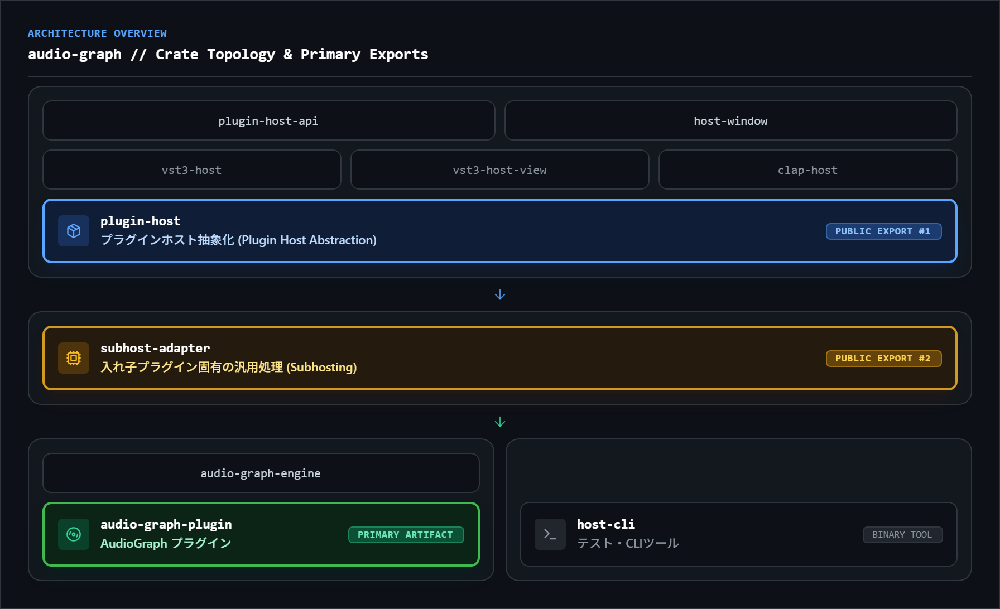

<div align="center">

# AudioGraph

**A _node-based_ Instrument / Effect plugin
for VST3 and CLAP plugins**

**中でプラグインを読み込んで、ノードベースで音を弄れるプラグイン**<br>
**音、パラメーター、MIDIをすべてをノードで編集できます。**


</div>

## Why AudioGraph?

DTMで、ディレイループにエフェクトを掛けることは、伝統的なトラックベースの音声処理では不可能です。

また、不可能ではない表現でも、複雑なエフェクトや複雑な音声ルーティングは見にくく作業しずらい。

ノードなら全て解決できます。一発で音声やパラメーターの流れを理解でき、作業しやすく、表現力も完全上位互換。
マクロやLFOなど、手持ちのプラグインに存在しない機能を外から取り付けることもできます。

音源/エフェクト問わず、複数のプラグインを組み合わせて大きなマクロを組むことも可能。

## Getting Started / Features

1. [Releases](https://github.com/helgev-in-arcana/audio-graph/releases) から環境に合わせてダウンロード
2. DAW で AudioGraph を立ち上げ、`Plugin folders` に手持ちのプラグインのスキャンディレクトリを登録
3. 空白を右クリック（または `Add Node`）でノードを置き、繋ぐ

機能、詳しい操作とノードの一覧は →[Nodes and Usage](docs/nodes-usage.md)

## Build from source

MSRV: Rust 1.95.0

```sh
cargo xtask bundle audio-graph-plugin --release
```

`target/bundled/` に `AudioGraph.vst3` と `AudioGraph.clap` ができます。

## [Architecture](docs/architecture.md)

[](docs/architecture.md)

## plugin-host — xPlatformプラグインホストライブラリ

副産物として、**Rust から VST3 / CLAP プラグインをホストするためのライブラリ**が
`plugin-host` クレートとして手に入ります。形式は拡張子から決まり、コードに形式名は現れません。

```rust
use plugin_host::{Plugin, SubPluginMain};

let mut plugin = Plugin::load(path, None, host_context)?;   // .vst3 でも .clap でも同じ
let mut processor = plugin.activate(config)?;
processor.process(&mut buffers, &events, &time, &mut out_events);
plugin.deactivate(processor);
```

現時点では API は AudioGraph の内部利用が主で、安定していません。

## Roadmap

→[Roadmap](docs/roadmap.md)

## Notice / 注意

🚧🚧🚧―――――――――――――――――――――――――――――――――――――――

- 現在アルファ版です。任意のリリースに破壊的変更の可能性が含まれます。
- UIは現在仮組みです。改良中です。
- コード署名が現在ありません。
- 実 DAW で動作確認ができているのは **Windows (x86_64)** のみです。
  - **Linux (x86_64)** は X11 でウィンドウが開くところまで実装・確認済みです。確認は `host-cli` (ウィンドウ、サブプラグインの埋め込み、エディタ、オーディオ経路) までで、実 DAW と市販プラグインでの確認はこれからです。Wayland セッションでは XWayland 経由で動きます。
  - **macOS** はビルドが通っているだけで、ウィンドウ実装がまだありません。
  - 手持ちのVST3とCLAPで動作確認していますが、規格のすべてをテストできている保証は無いです。
- VST2ネイティブ対応はライセンスの問題で今後も不可能です。VST3化ツールなど使ってください。
- このリポジトリはAI駆動で開発されており、私([@helgev-in-arcana](https://github.com/helgev-in-arcana))が設計・コード監査を進めています。<br>
  §Architecture など、クレート/モジュ―ル構成、依存フローの構造は確認/リファクタが完了しています。

―――――――――――――――――――――――――――――――――――――――🚧🚧🚧

## License

MIT OR Apache-2.0

配布バイナリに組み込まれる依存ライブラリとフォントの著作権表示は
[THIRD-PARTY-NOTICES.md](./THIRD-PARTY-NOTICES.md) にまとめてあります。

VST is a trademark of Steinberg Media Technologies GmbH, registered in Europe
and other countries. 本プロジェクトは Steinberg Media Technologies GmbH と
提携・関連するものではありません。
