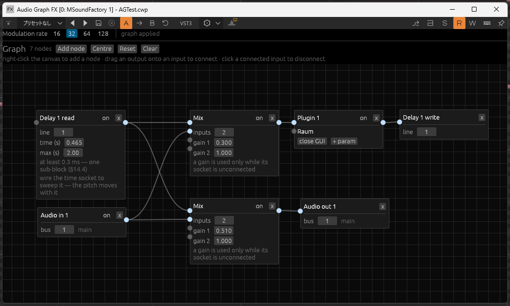

# AudioGraph (v0.1.2-alpha)

中でプラグインを読み込んで、ノードベースで音を弄れるプラグインです。

音の配線、パラメーターの配線、MIDIの配線すべてをノードで編集できます。



## 現時点でできること

- Fx と Instrument の 2 クラスを 1 バイナリから提供
- **VST3 と CLAP の両方を読み込める**（同じグラフの中で混在できます）
- プラグイン読み込みは16個まで
- 音声、MIDI、パラメーター値のノードベース編集
- DAWからのオートメーションスロットが32本
- 自動遅延保証対応

## 現時点でできないこと

- Win以外の対応 (Win11(x86_64)のみ動作確認)
- プラグイン読み込み制限を無くしたい
- プラグインプロセス分離
- 32bitプラグイン読み込み
- 出力バスを 2 本以上持つプラグインのソケットは表示されますが、実機での検査は未実施です。
- 出力バスを 1 本も宣言しないプラグインは、オーディオのコンパイル対象から外れます。

## 今後も出来ないこと

- VST2ネイティブ対応
  - 　ライセンスがありません
- VST3のAudioGraphでの可変数オートメーションスロット

## 把握しているバグ

- ディレイノードでディレイ量が変化したときに波形の補間がうまくいっていない
- ゲインが実数倍率になっている
- ほか、存在するであろう未発見のバグ

見つけた場合はIssueまで。
一方で、現在アルファ版ですので開発によってバグが直ったり増えたり復活したりするかもしれません。

## リリース

https://github.com/helgev-in-arcana/audio-graph/releases

- Windows (x86_64) 以外は一切動作確認していません
- LinuxとmacOSはGUIまわりで動かないはずです。

## License

MIT OR Apache-2.0

配布バイナリに組み込まれる依存ライブラリとフォントの著作権表示は
[THIRD-PARTY-NOTICES.md](./THIRD-PARTY-NOTICES.md) にまとめてあります。

VST is a trademark of Steinberg Media Technologies GmbH, registered in Europe
and other countries. 本プロジェクトは Steinberg Media Technologies GmbH と
提携・関連するものではありません。

## 注意

🚧🚧🚧―――――――――――――――――――――――――――――――――――――――

- 現時点のコミット先頭はほとんどバイブコードされた状態です。
  - 私(@helgev-in-arcana)が現在コード・設計監査を進めています。
- UIは現在仮組みです。改良中です。
- 現在アルファ版です。任意のリリースに破壊的変更の可能性が含まれます。
- コード署名が現在ありません。
- 今はアルファ版で、動作確認ができているのは Windows (x86_64) のみです。読み込めるプラグインは VST3 と CLAP です。
  - リリースに色んなビルドが並んでますが、**Windows (x86_64) 以外は一切動作確認していません**。ビルドが通っているというだけの状態です。
    - LinuxとMacはおそらくGUIが出ないと思われます。
  - 手持ちのVST3とCLAPで動作確認していますが、規格のすべてをテストできている保証は無いです。
  - VST2ネイティブ対応はライセンスの問題で不可能です。VST3化ツールなど使ってください。

―――――――――――――――――――――――――――――――――――――――🚧🚧🚧

---

❗以下Claude執筆❗

---

## ビルド

Rust（edition 2024 が通る版）が必要です。

```sh
cargo xtask bundle audio-graph-plugin --release
```

`target/bundled/` に `AudioGraph.vst3` と `AudioGraph.clap` ができます。

開発時は先に `cargo build --workspace` を通してから `cargo test --workspace`
を実行してください（`cargo test` は他パッケージの cdylib を作らないため）。

## 導入

出来上がったバンドルを、使う形式のフォルダへ置きます。

| 形式 | Windows | Linux | macOS |
|---|---|---|---|
| VST3 | `C:\Program Files\Common Files\VST3\` | `~/.vst3/` | `~/Library/Audio/Plug-Ins/VST3/` |
| CLAP | `C:\Program Files\Common Files\CLAP\` | `~/.clap/` | `~/Library/Audio/Plug-Ins/CLAP/` |

DAW を再スキャンすると `Audio Graph FX` と `Audio Graph Instrument` の 2 つが現れます。

## 使い方

1. トラックに AudioGraph を挿してエディタを開く
2. キャンバスに **Plugin ノード**を置き、手持ちの VST3 か CLAP を読み込む
3. `Audio In` → Plugin → `Audio Out` を繋ぐ（ここまでで普通のプラグインとして音が通ります）
4. **LFO ノード**などを置き、その出力を Plugin ノードのパラメータソケットへ繋ぐ

繋げられるのは同じ型のソケット同士だけです（音・ノート・パラメータ値の 3 種、色で区別できます）。
入力ソケットは線を 1 本しか受けないので、合流は `Mix` ノードで行います。ゲインも `Mix` が持ちます。

DAW からのオートメーションは **スロット**（32 本）を通り、`SlotIn` ノードとして現れます。
グラフからサブプラグインのパラメータへ書き込むには、Plugin ノードのパラメータソケットへ
繋ぎます（かつては `SlotOut` でスロットを上書きできましたが、DAW のオートメーションと
奪い合いになるため廃止しました）。

信号の ON/OFF は `Audio Gate` と `MIDI Gate`、値の切り替えは `Param Select` です。
MIDI キースイッチで分岐させたいときは `Key MIDI Route`（送出先の切り替え）と
`Key Param Select`（パラメータ値の切り替え）を使います。どちらも行き先／値ごとに
鍵を 1 つ持ち、`Mix` の入力と同じように増減できます。`Key MIDI Route` の操作に使う鍵は
既定では下流へ流れません（鳴らすためではなく選ぶために弾く鍵なので）。流したいときは
ノードの **mute switching keys** を外してください。`MIDI Gate` が閉じている間は
ノートオンだけが止まり、ノートオフは通るので、鳴っている音が吊ることはありません。

ノード名は `[制御] <出力型> <動詞>` の順です。型語（`Audio` / `MIDI` / `Param`）が
付くのは型をまたぐノードと名前が衝突するノードだけで、`Constant` や `LFO` のように
出力型が自明なものには付きません。動詞はソケットの形と対応していて、`Gate` は
通す／止める（入 1・出 1）、`Select` は候補から 1 つ選ぶ（入 N・出 1）、`Route` は
1 本を行き先の 1 つへ送る（入 1・出 N）、`Map` は値を連続的に変換します。

ディレイは `DelayWrite` と `DelayRead` の 2 ノードに分かれていて、`line` 番号で対応づきます。
線で繋がっていないのでフィードバックが組めます。1 本の line を複数の `DelayRead` が読めばマルチタップです。

### プラグインが一覧に出てこないとき

エディタ上部の **Plugin folders** を開いてフォルダを追加してください。初回起動時に
その OS の慣例的な設置場所が書き込まれており、以降はそこに並ぶフォルダが探索対象の
すべてです。慣例由来の行も削除できます。消しすぎたときは **Add the usual folders** で戻ります。

設定はユーザーごとの領域（Windows は `%LOCALAPPDATA%\AudioGraph\config.json`、
macOS は `~/Library/Application Support/AudioGraph/`、
Linux は `$XDG_CONFIG_HOME/audio-graph/`）に保存され、同じマシンの全インスタンスで共有されます。

## host-cli — DAW なしで確かめる

DAW を立ち上げずに、実物のプラグインを相手に検証できる CLI が付属します。
プラグインを指す引数は `.vst3` でも `.clap` でもかまいません。

```sh
cargo run -p host-cli -- <コマンド>
```

主なコマンド：

| コマンド | 内容 |
|---|---|
| `dirs` | 実際に探索する設置場所と設定ファイルの位置 |
| `scan [DIR...]` / `info` / `params` / `buses` | 見つかったプラグインの中身を列挙 |
| `render <PLUGIN> <IN.wav> <OUT.wav>` / `synth <PLUGIN> <OUT.wav>` | 音を出す |
| `graph` / `chain` / `instrument` / `sidechain` / `delay` | グラフの振る舞いを検査する |
| `churn` / `twice` / `state` / `sweep` / `probe` / `gui` | 寿命まわりを痛めつける |

`cargo run -p host-cli -- --help` で全コマンドが出ます。

## プラグインホストライブラリ

副産物として、**Rust から VST3 / CLAP プラグインをホストするためのライブラリ**が
`plugin-host` クレートとして手に入ります。形式は拡張子から決まり、コードに形式名は現れません。

```rust
use plugin_host::{Plugin, SubPluginMain};

let mut plugin = Plugin::load(path, None, host_context)?;   // .vst3 でも .clap でも同じ
let mut processor = plugin.activate(config)?;
processor.process(&mut buffers, &events, &time, &mut out_events);
plugin.deactivate(processor);
```

現時点では API は AudioGraph の内部利用が主で、安定していません。
