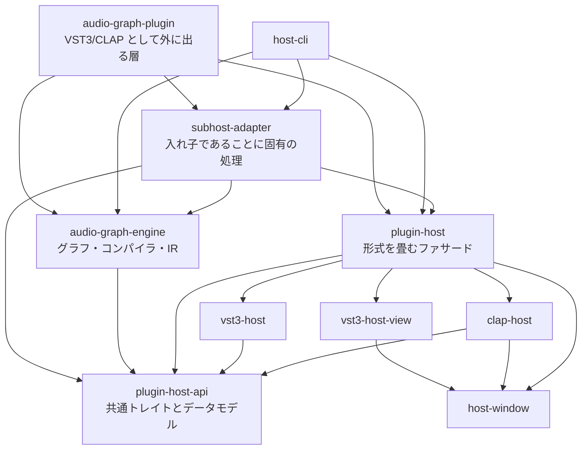

# Development

「プラグインの中でプラグインをホストする」構造なので、DAW からはひとつのプラグインに見えて、
内側では自分がホストとして VST3 / CLAP を抱えています。設計上の要点は 3 つです。

### 1. 形式の違いは一番外側で吸収する

VST3 と CLAP は思想からして別物ですが、その差を上の層に持ち上げないようにしています。
`plugin-host-api` が両者に共通する抽象（トレイトとデータモデル）だけを定義し、
`vst3-host` と `clap-host` がそれぞれを実装、`plugin-host` が単一のファサードとして畳みます。

結果として、ノードグラフも CLI も「形式」を知りません。3 つ目の形式が増えても、
変更は `plugin-host` の分岐一箇所で済みます。

このAPIには、シグネチャにプロセス境界を越えられない型を出さないという制約も掛けてあります。
将来プラグインを別プロセスで動かす場合に、実装の差し替えで済ませるためです。

### 2. スレッドの区別を型に落とす

オーディオスレッドとメインスレッドの規則は、本来ドキュメントに書かれた約束事でしかありません。
これを型の側に移しています。

- **メインスレッド用とオーディオスレッド用でトレイトを分けている** — `activate` が処理側のオブジェクトを値として返すので、有効化していないプラグインに `process` を呼ぶことがコンパイルエラーになります。
- **スレッド親和性を値にする** — プラグインは両形式とも `Send` を要求される一方、VST3 のコントローラ側はメインスレッドからしか触れません。型システム上は両立しないので、生成スレッドを保持して毎アクセスで検査する型に包み、`unsafe` を一箇所に閉じ込めています。破れた場合は破損ではなく明確な panic になります。

### 3. オーディオスレッドは判断せず、実行するだけにする

編集用のグラフをそのまま鳴らすと、オーディオスレッドの中で「この入力は繋がっているか」「この値は clamp が要るか」
といった判断が毎ブロック走ります。そこでコンパイル段を挟みました。

編集グラフは UI スレッドで **フラットな命令列（レジスタマシン）** に変換されます。
コンパイル済みの `Program` には `Rc` も `Box<dyn>` もマップ探索もなく、実行は `Vec` を走査するだけです。
必要な領域は上限付きで、上限を超えるグラフは `process` の中で確保するのではなく、
コンパイル時に読めるエラーで拒否されます。

差し替えの受け渡しも、ロックせず、オーディオスレッドで `free` しないようにしています。
下り 1 枠・戻り数枠の受け渡し口を用意し、オーディオスレッドは「古いものを置く場所がある」ことを
確認してから新しいものを取ります。戻り枠が埋まっていれば 1 ブロック分だけ現行のプログラムを続けるだけで、
編集が 1 ミリ秒遅れて反映されることは誰にも聞こえません。

なお、循環や入力欠けは panic ではなく値として返します。描いている途中のグラフでは普通の状態なので、
エディタはメッセージを出しつつ最後に成功したプログラムを鳴らし続けます。

### クレート構成



`audio-graph-engine` が依存するのは抽象 API だけで、具体的なホスト実装には触れません。
両者を繋ぐのは `subhost-adapter` の役目で、このクレートは「入れ子であること」に固有の処理
——DAW のトランスポートを下へ流す、レイテンシを合成して上へ返す、状態を入れ子に保存する——
だけを持ちます。オフラインレンダラやプラグインスキャナでも必要になる処理は、
ここではなく `vst3-host` 側に置く、という基準で切り分けています。

DAW に公開するパラメーターも、中のプラグインのパラメーターを直接見せるのではなく、
固定数のスロットを公開して各スロットを紐付ける形にしています。
中のプラグインを差し替えても DAW のオートメーションが壊れないようにするためです。

## Testing / host-cli

プラグインは「DAW に読み込んで手で操作する」以外の検証手段を持ちにくい領域です。
そこで、DAW を立ち上げずに実物のプラグインを相手に検証できる CLI を同梱しています。
引数のプラグインは `.vst3` でも `.clap` でもかまいません。

```sh
cargo run -p host-cli -- <コマンド>
```

| コマンド                                                          | 内容                                       |
| ----------------------------------------------------------------- | ------------------------------------------ |
| `dirs`                                                            | 実際に探索する設置場所と設定ファイルの位置 |
| `scan [DIR...]` / `info` / `params` / `buses`                     | 見つかったプラグインの中身を列挙           |
| `render <PLUGIN> <IN.wav> <OUT.wav>` / `synth <PLUGIN> <OUT.wav>` | 音を出す                                   |
| `graph` / `chain` / `instrument` / `sidechain` / `delay`          | グラフの振る舞いを検査する                 |
| `churn` / `twice` / `state` / `sweep` / `probe` / `gui`           | 寿命まわりを痛めつける                     |

`cargo run -p host-cli -- --help` で全コマンドが出ます。


<!--

設計の考え方とクレート構成は README の
[How It Works](../README.md#how-it-works) にまとめてあります。

## ビルド

MSRV: Rust 1.95.0

```sh
cargo xtask bundle audio-graph-plugin --release
```

`target/bundled/` に `AudioGraph.vst3` と `AudioGraph.clap` ができます。

## host-cli — DAW なしで確かめる

DAW を立ち上げずに、実物のプラグインを相手に検証できる CLI が付属します。
コマンド一覧は README の [Testing / host-cli](../README.md#testing--host-cli) にあります。

```sh
cargo run -p host-cli -- --help
```

## テスト

```sh
cargo test --workspace
```

`clap-test-plugin` は、外部プラグインに依存せずホスト側を試すための
テスト用 CLAP プラグインです。

-->
