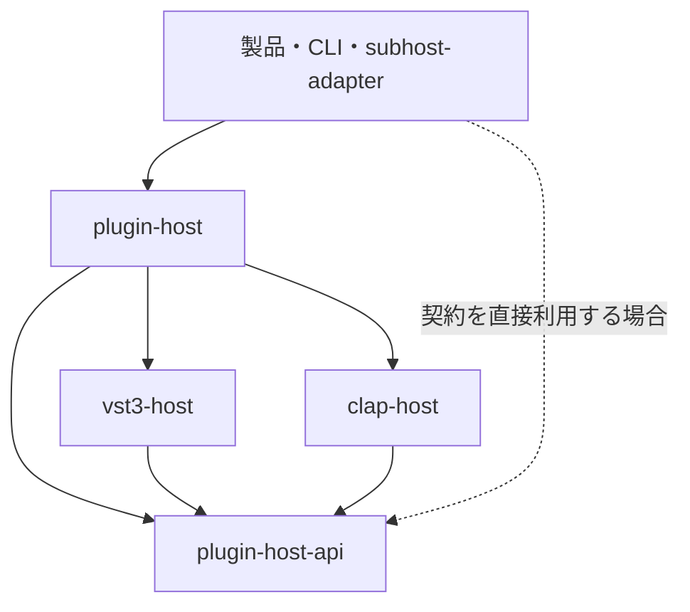
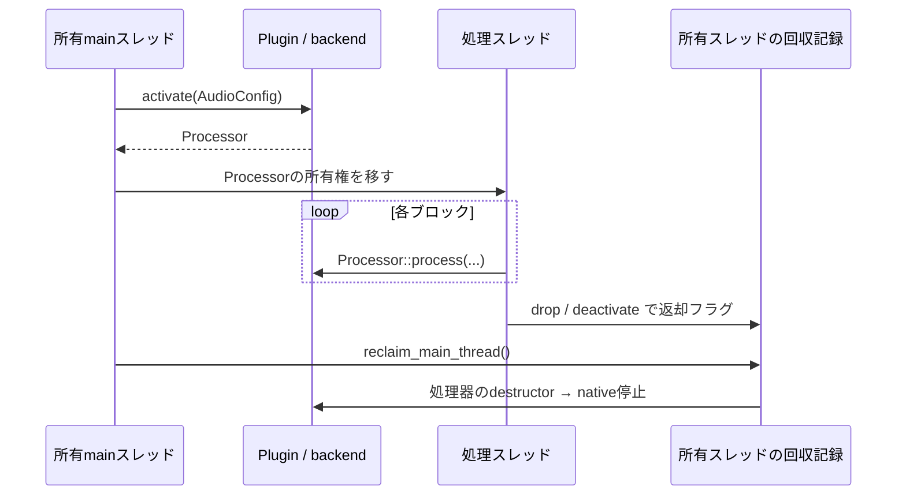

# plugin-host-api の構造と全公開API

更新日: 2026-09-12。監査基準は main `e2b629b`、本解説は契約修正後の実装に更新済み。クレート版 `0.1.5`。

実装と公式仕様を照合した解説。[監査基準版の結果](audits/plugin-host-review-2026-09-11.md)、[修正内容と検証](audits/plugin-host-contract-fixes.md)、[plugin-hostの解説](plugin-host-guide.md)を併読する。

「全API」は、この版の公開型・公開フィールド・列挙値・関数・固有メソッド・traitメソッド・再exportを指す。private関数は構造を理解するために必要なものを説明する。自動導出された標準traitは末尾にまとめる。

## 1. このクレートの位置

`plugin-host-api` は、形式を知らない呼び出し側と形式を知るバックエンドが共有するRustの契約である。VST3/CLAPのC/C++ ABIをそのまま包んだ型の集合ではない。パラメーター、ノート、transport、平坦な音声バッファを独自の語彙に直し、処理と管理を分ける。外部クレートへの依存はなく、標準ライブラリーには依存する。

実行時には依存の矢印と逆向きの呼び出しもある。バックエンドが `HostContext` を呼ぶのは、呼び出し側が実装したサービスへのコールバックであり、製品クレートへのコンパイル依存ではない。

| 内部モジュール | 所有する責務 | 境界 |
| --- | --- | --- |
| `lib.rs` | 公開窓口、`HostError`、`Result` | 他の内部モジュールは非公開。型をクレート直下へexportする |
| `traits.rs` | main側、処理側、host通知の契約 | 読み込み・OSウィンドウ・グラフ計画を扱わない |
| `ownership.rs` | 所有スレッドでのアクセス・回収、processorの所有ハンドル | VST3/CLAPのactivate手順自体はバックエンドが実装する |
| `params.rs` | パラメーター情報、能力、ボイス数、I/O情報 | 情報を読むネイティブAPIは扱わない |
| `events.rs` | 時刻付きイベント、出力先、transport | 規格との変換はバックエンド、グラフ内の時刻調整は上位層 |
| `buffers.rs` | ブロックのメモリー表現、activate用の構成 | 音声メモリーの確保やバス交渉自体は行わない |

この規模で上記を別クレートへ分け直す必要は見当たらない。`ownership` が実行時機構を持つことも、共通の寿命契約を具体化するという目的に沿っている。

### 「IPCを意識したAPI」の意味

平坦な音声、まとめ読み、バックエンド固有ポインターを値モデルへ出さない選択は、将来のプロセス分離に役立つ。しかし現APIは、そのまま送受信できるwire protocolではない。`String`、`Vec`、借用スライス、trait object、`Processor`、`MainThread` はプロセス内のRust表現である。`AudioConfig` が `Copy` でも安定したABI・エンディアン・バージョン互換性は保証されない。

将来のIPC実装では、proxy、符号化、共有メモリーの領域指定、通知配送、worker終了時の契約が別途必要。「依存ゼロだからIPCで無変更に置き換えられる」というREADMEの説明は強すぎる。

## 2. ライフサイクルを先に理解する

### 規格の対応

VST3では音声処理を担う `IComponent` / `IAudioProcessor` と、パラメーター・UIを担う `IEditController` が分かれる。同一オブジェクトが両方を実装する場合も、別オブジェクトの場合もある。CLAPは一つの `clap_plugin` と拡張インターフェースを使う。共通APIのmain/processor分割は、CLAP内部にも別オブジェクトが必ず存在するという意味ではない。[VST3 component][V2]、[VST3 controller][V3]、[CLAP plugin][C1]

| 共通操作 | VST3実装 | CLAP実装 |
| --- | --- | --- |
| load/create | moduleのfactoryからcomponentを作成し、controllerを取得・接続 | factoryでdescriptor IDを指定し、plugin作成・init・extension取得 |
| `activate(config)` | バス設定、`setupProcessing`、`setActive(true)`、`setProcessing(true)`、処理用変換表の準備 | ポート割当、render設定、`activate`、`start_processing`、処理用メモリーの準備 |
| `process` | `ProcessData`に音声・parameter queues・event list・contextを詰める | `clap_process`に音声・イベント・transportを詰める |
| `reset` | 現実装は`setProcessing(false/true)` | `clap_plugin.reset` |
| processor返却・回収 | `setProcessing(false)`、`setActive(false)` | `stop_processing`、`deactivate` |
| instance最終破棄 | editor解除、接続解除、terminate、interface解放、module解放 | editor破棄、必要なら停止、destroy、host/module解放 |

規格上の順序と実装の対応の要点であり、エラー時の分岐や全extensionを列挙した表ではない。[VST3 audio processor][V4]、[CLAP plugin][C1]

同じ所有スレッド上で返却した場合は、その場で回収を試みる。他スレッドからの `deactivate()` の戻りは、native停止の完了通知ではない。次のactivate/load_stateはバックエンド内で回収を行い、既存activationが残っていれば拒否する。

CLAPのaudio threadは一つの固定OSスレッドという意味ではない。対象instanceのaudio操作を同時実行しないことが重要で、main OSスレッドが一時的にその役割を担うこともできる。現バックエンドは `AudioThreadGuard` でstart/stop/reset/processの役割を示す。[CLAP thread-check][C2]

## 3. 管理・処理・通知のtrait

### `SubPluginMain`

main側の制御窓口。`Plugin`、`Vst3Plugin`、`ClapPlugin` が実装する。`Send` を要求しないtraitである。これは「すべての実装を必ず `!Send` にする」というRustの型制約ではない。実際のnative実装の非Send性や `MainThread` の実行時検査も併せて制約を維持している。

| メソッド | 実際に行うこと・戻り値 | この形である理由・利用条件 |
| --- | --- | --- |
| `tick(&mut self)` | editorの有無にかかわらずmain保守を進める | native通知を配送。通常終了前も最後に一度呼ぶ。破棄後は未配送要求を捨て、destructorから再構成しない |
| `refresh_metadata(&mut self) -> Result<MetadataUpdate>` | 更新の完了状態を返す | 下表に従い停止・再試行する。読取失敗や読取中の追加変更は完了扱いしない |
| `request_main_bus_channels(&mut self, input: u16, output: u16) -> Result<()>` | inactive中にmain幅を要求 | VST3は既存auxを保った交渉、CLAPは固定幅との一致確認。拒否時も選ばれた構成を読み直す |
| `note_end_ports(&self) -> Vec<i16>` | native終了通知を持つ入力port番号 | CLAP入力portの対応方言から判定。VST3/デフォルトは空。mainで取得し処理側へ保持 |
| `params(&self) -> &[ParamInfo]` | キャッシュされた全パラメーター記述への借用 | 一件ずつnative getterを呼ぶAPIを上位へ出さない。呼ぶたびにnative情報を更新するわけではない |
| `capabilities(&self) -> Capabilities` | instance単位の対応能力 | 処理前に経路を選ぶため。個々のparameter/portの全能力は表していない |
| `voice_info(&self) -> Option<VoiceInfo>` | デフォルト`None`。CLAPはactive時に取得したキャッシュ | CLAP `voice-info.get` はactive mainで問い合わせる。未有効化時は`None` |
| `note_dialects(&self) -> Vec<&'static str>` | 診断用のノート方言名。デフォルト空、VST3も空 | 表示用。ポート別の交渉・配送に使える型ではない |
| `io_layout(&self) -> IoLayout` | キャッシュされた音声・note I/Oの読み取り | getterは交渉しない。希望するmain幅はinactive中の`request_main_bus_channels`で明示する |
| `snapshot(&self) -> ParamSnapshot` | 全parameterの現在値。VST3はcontrollerのnormalized値をplainへ変換。CLAPは`get_value`成功項目を収集 | 一括読み取り。native DSPのある一時点と原子的に一致するsnapshotを保証するものではない |
| `param_to_text(id, plain) -> Option<String>` | plugin独自の表示文字列 | 単位・enum名・丸めはpluginが所有。VST3はplain→native normalized→文字列、CLAPは`value_to_text` |
| `param_from_text(id, text) -> Option<f64>` | pluginの構文で文字列をplain値に変換 | 上位がHz/dB等の構文を再実装しない。失敗は`None` |
| `set_param(&mut self, id, plain) -> Result<()>` | main側から値を設定。VST3はcontroller更新とprocessor向けqueue。CLAPはqueueへ入れ、inactive時にはflush | CLAPに直接setterはない。active時のDSP更新は次回processへ送る。成功は「その時点でDSPまで同期済み」を意味しない |
| `save_state(&self) -> Result<Vec<u8>>` | plugin固有stateを保存 | native stateが保存内容の権威。VST3はcomponent/controllerの2領域に各u32 little-endian長を前置、CLAPはstate extensionのbyte列。CLAPにstate extensionがなければ空 |
| `load_state(&mut self, data) -> Result<()>` | opaque stateを復元 | 現両バックエンドはactive時に拒否。VST3はcomponent stateをcontrollerにも知らせる。CLAPは復元前のpending editsも消す |
| `latency_samples(&self) -> u32` | 保持している報告遅延、sample単位 | activate後の値を使う。グラフの総遅延や親DAWへの報告値を計算するAPIではない |
| `activate(&mut self, AudioConfig) -> Result<Processor>` | 構成を交渉・準備し、そのactivationを所有する処理ハンドルを返す | main側に任意のprocessorを返すAPIを置かず、誤ったinstanceへのdeactivateを防ぐ。既存activationがあれば`InvalidState` |

パラメーターのgetter・文字列化・変更通知は[VST3 controller][V3]と[CLAP params][C3]、stateの扱いは[VST3 component][V2]と[CLAP state][C4]、ボイス情報は[CLAP voice-info][C5]に対応する。共通APIが要求する「load_stateはinactive」という制約は、全規格の全state操作が常に同じ制約を持つという主張ではない。

### `MetadataUpdate` と更新手順

| 値 | 次に行うこと |
| --- | --- |
| `Unchanged` | 読み直す未適用記述はない |
| `Refreshed` | getterが更新済み。必要な上位表示・対応表を更新 |
| `NeedsDeactivation` | Processorを返し、mainでrefreshを再試行。更新後の情報で接続・parameter対応・AudioConfigを作ってactivate |

表示だけの変更はactiveのまま反映する。parameter ID/範囲/default/flagsが処理用キャッシュと異なる場合や構造通知は停止が必要。VST3のlatency変更も再有効化を要する。失敗時は要求を保持し、更新が完了するまでactivateを拒否する。state復元は先行callbackを処理した後に実行し、復元後の記述も更新する。getter呼出自体に設定変更はない。[VST3 restart flags][V3]、[CLAP params][C3]

### `SubPluginProcessor: Send`

| メソッド | 動作 | 呼び出し側の条件 |
| --- | --- | --- |
| `process(&mut self, &mut AudioBuffers, &[Event], &TimeContext, &mut EventSink) -> ProcessStatus` | 一ブロックの音声・parameter・noteを処理し、音声とイベントを出力 | 排他的に呼ぶ。blockはactivate時の構成に一致させる。入力eventsはsample offset順。音声処理経路で確保・待機を避ける |
| `reset(&mut self)` | 尾音・内部処理状態のリセット要求 | processと同時実行しない。パラメーターや保存済みpresetの初期化とは別 |

`&mut self` が同時のsafe呼び出しを防ぐ。traitが `Sync` を要求しないことは、任意の実装が `Sync` を持つこと自体を禁止するものではない。公開 `Processor` は `Send` で、`Sync` ではない。

共通EventSinkの追加・容量超過は確保しない。両backendのmain→audio編集queueには既存の`try_lock`が残るため、待機しないこととmutex操作が一切ないことは別である。第三者プラグイン内部まで無確保と保証するものではない。

### `ProcessStatus`

| 値 | APIが説明している意味 | 現バックエンドの対応 |
| --- | --- | --- |
| `Silent` | 新しい入力まで沈黙が続く | CLAPは`SLEEP`。VST3はmain outputの今回のsilence flagsから返すため、継続的なsleepと同値ではない |
| `Continue` | 非無音、またはtailなどで処理継続 | CLAPのCONTINUE系・TAIL等をまとめる。VST3の通常成功もこれ |
| `Error` | 処理失敗。呼び出し側がbypass等を判断 | native失敗や最大block超過。全Error経路で出力を同じようにclearする保証はない |

`Silent` を根拠に後続ブロックまで処理を停止してよいとは、現両backend共通には言えない。今回の無音という観測と次回以降の実行方針の区別が必要。[CLAP process][C6]、[VST3 AudioBusBuffers][V4]

### `HostContext: Send + Sync`

呼び出し側が実装し、facadeのloadへ `Arc<dyn HostContext>` として渡す。具体的なVST3 host objectやCLAP host structは、バックエンドがこのサービスを利用して構築する。READMEの「バックエンドはhost objectを作らない」は、native shimも構築しないという意味ではない。

| メソッド | 要求・デフォルト動作 | 現状の注意 |
| --- | --- | --- |
| `host_name(&self) -> &str` | pluginへ見せるhost名。実装必須 | nativeにはbackendがコピー/変換する。DAW名を自動で引き継がない |
| `request_restart(&self, RestartReason)` | 変更通知を受け、hostが再構成を予定する | native要求はcoalesceし、main側の`tick`で配送する。callback中の同期再構成は禁止 |
| `latency_changed(&self, samples: u32)` | デフォルトはsample値を使わず`request_restart(Latency)` | 通知値はそのinstanceの値。総遅延の合算は上位の仕事 |
| `param_edited(&self, id, plain)` | GUI等からのparameter編集通知。デフォルト何もしない | VST3実装は現在normalized値を渡す。CLAPのprocess出力は`EventSink`に入り、このmethodへ統一されていない |

`Send + Sync` はRT安全性、main thread配送、コールバック非再入を保証しない。受信したその場でplugin再構成を始める設計は避け、通知記録と適切なスレッドでの適用を分ける必要がある。AudioGraphがGUI編集を採用しないのは製品側の方針であり、汎用hostの必須規則ではない。[CLAP host][C7]、[VST3 IComponentHandler][V3]

### `RestartReason`

| 値 | 共通の意味 | 代表的なnative通知 |
| --- | --- | --- |
| `ParamValues` | parameter値が変わった | VST3 `kParamValuesChanged`、CLAP `RESCAN_VALUES` |
| `ParamTitles` | parameter記述の変化 | VST3 `kParamTitlesChanged`、CLAP `RESCAN_INFO/TEXT`。VST3のflagはstepCount/default/flags変更も含むため、実際の処理用情報を比較する |
| `ParamList` | parameter集合等の再取得 | CLAP `RESCAN_ALL`。inactiveになってから更新する |
| `Latency` | reported latency変化 | VST3 `kLatencyChanged`、CLAP latency通知 |
| `IoConfig` | I/O再構成が必要 | VST3 `kIoChanged`、CLAP audio/note ports通知。CLAPの一般restartも現実装ではこれ |

このenumは通知理由であり、更新完了の証明ではない。backendがinstanceごとの未適用要求を保持し、`refresh_metadata`の結果で呼び出し側が次の操作を決める。

## 4. 所有権API

### `MainThread<T: 'static>`

| API | 動作・理由 |
| --- | --- |
| `new(value: T) -> Self` | 現在のスレッドを所有者として値と返却記録を確保。名前だけでOSのmain threadかを検査することはない |
| `is_owner(&self) -> bool` | 現thread IDと生成元の一致を調べる |
| `get(&self) -> &T` | 所有threadだけ参照可能。他threadはpanic |
| `get_mut(&mut self) -> &mut T` | 所有threadかつハンドルの排他的借用が必要。他threadはpanic |
| `try_get(&self) -> Option<&T>` | 他threadなら`None`。失敗をpanicにしない取得 |
| `Drop` | 返却を記録。native値のdestructorは所有threadでのみ実行 |
| `Send` / `Sync` | Tが非Send/非Syncでもハンドルの移動・共有を許す。値のアクセス・破棄をownerに限定することで成立 |

`T: 'static` はTを永久に保持するという意味ではない。ownerより先に失効する借用データを含めないための制約。`Clone`、`into_inner`、他threadでTを取り出すAPIはない。

### `Processor`

| API | 動作・理由 |
| --- | --- |
| `new(value: impl SubPluginProcessor + 'static) -> Self` | backend実装を所有し、生成threadへ返却するハンドルを作る。バックエンド実装者向けの公開入口 |
| `deactivate(self)` | 自身のactivationを消費して返却する。別instanceを引数に取らない |
| `SubPluginProcessor::process/reset` | 保持しているtrait pointerへ直接委譲する。呼び出し自体にregistry検索・参照カウント更新を追加しない |
| `Drop` | `deactivate`と同じ返却経路。明示deactivateを忘れても所有権の解放で返却する |
| `Send` | 処理threadへ移動可能。複製するAPIはない |

ハンドルは任意のbackend内のraw pointerの正しさまで自動証明しない。backendは処理中に必要なnative instance、module、host callbackを処理器の中に保持する必要があり、現VST3/CLAP実装は共有されたinstance guardでこれを行う。

### `reclaim_main_thread()`

呼んだthreadの返却済み資源を回収する。別threadのregistryを回収する関数ではない。hostはmain loopと通常終了処理から呼ぶ。`Plugin::tick`やwindowの`poll`と同一操作ではない。

内部では値を `UnsafeCell` と返却用 `AtomicBool` を持つ安定アドレスの領域へ置き、ownerのthread-local registryに登録する。他threadのDropはRelease store、owner側はAcquire load後に破棄する。destructor実行中にregistryの借用を保持せず、子資源の返却も回収できるようにする。

回収はownerの登録資源を走査し、native停止・破棄も実行するためaudio hot pathから呼ぶ関数ではない。owner終了時は返却済み分を回収するが、別threadが未返却の値は保持されたままになる。これは誤thread破棄や使用中解放を防ぐfail-safeであり、正常終了を完了する仕組みではない。通常終了では処理の終了・返却・owner回収を先に済ませる。

## 5. パラメーター・能力・バス情報

### `ParamId(pub u32)`

stable parameter識別子を包む型。VST3 `ParamID` とCLAP `clap_id` がともに32bitであることを利用する。identityはplugin instance/種類の文脈の中で意味を持つ。別pluginの同じ数値を同一parameterとみなしてはいけない。public tuple field `.0` で生のIDを取り出せる。

### `ParamFlags(pub u32)`

独自bit集合。native flagの数値をそのまま保持する型ではなく、backendが変換する。

| 定数 | このAPIでの意味 | 規格との関係 |
| --- | --- | --- |
| `NONE` | 0、何も立っていない | 独自の便宜 |
| `STEPPED` | 離散値。docではmin〜maxの整数 | CLAPは整数値。VST3はstepCount由来で、任意のplain値スケールと同じ意味とは限らない |
| `PERIODIC` | 周期的な値 | CLAP periodic / VST3 wrap-around |
| `HIDDEN` | 汎用UIに表示しない | 各規格のhidden |
| `READONLY` | hostから設定しない | 各規格のread-only |
| `BYPASS` | plugin内のbypass parameter | 音声処理をhost側で停止する命令ではない |
| `AUTOMATABLE` | automation可能 | 各規格のautomation flag |
| `MODULATABLE` | base値を破壊しないmodulationが可能 | CLAP PARAM_MOD。VST3はfalse |
| `POLY_MODULATABLE` | 何らかのvoice関連scopeでmodulation可能 | 現CLAP実装はnote-id/key/channelのOR。どれに対応するかはこのbitだけでは不明 |

| メソッド・演算 | 動作 |
| --- | --- |
| `contains(self, other)` | otherの全bitを含むか。`NONE`は常に含む |
| `union(self, other)` / `a | b` | bit ORで合成 |
| `set(&mut self, other, on)` | 指定bit群を立てる/消す |
| `a |= b` | 自身へOR |
| `.0` / `ParamFlags(raw)` | 生bitを読み書き。unknown bitを拒否する検査はない |

`Target` が示せるscopeと能力bitの粒度は一致していない。poly bitだけを見てNoteId宛を送ってよいとは限らない。enum属性、per-scope automation、per-port modulation等の全native情報は保持していない。[CLAP params][C3]、[VST3 ParameterInfo][V3]

### `ParamInfo`

| public field | 意味・現実装 |
| --- | --- |
| `id: ParamId` | stable ID |
| `name: String` | parameter表示名 |
| `module: String` | 意図は階層パス。CLAPは`module`。現VST3は`ParameterInfo.units`を格納し、unit階層を辿っていない |
| `min: f64`, `max: f64` | plain範囲。CLAPからそのまま。現VST3はcontinuousならcontroller変換の両端、steppedなら0〜stepCount |
| `default: f64` | plain初期値。VST3はnative default normalizedをcontrollerで変換 |
| `flags: ParamFlags` | 上表の共通bit集合 |

| メソッド | 動作と意味 |
| --- | --- |
| `normalize(plain) -> f64` | `(plain-min)/(max-min)`を0〜1へclamp。spanが0なら0 |
| `denormalize(normalized) -> f64` | 0〜1へclampした値を線形にmin〜maxへ移す |
| `clamp(plain) -> f64` | min/maxの大小を整えた範囲へ制限する。steppedの整数化は行わない |

`normalize` は**plain範囲内の線形比率**であって、VST3のnative normalizedへの一般的変換ではない。VST3 pluginは対数等の変換を持てる。現backendはmainではcontroller変換、audioではactivate中に用意した `ParamMap` を使っており、このhelperをDSP用native変換として直接使ってはいない。非線形mapは257点の近似なので、数学的な完全一致を保証しない。[VST3 controller変換][V3]

たとえば20〜20,000Hzで1,000Hzの線形比率と、対数ノブのnormalized位置は異なる。これを同じ「normalized」と呼ぶと誤使用しやすい。VST3のstepped parameterでは、`min/max`のindex的な表現と`default/snapshot`のnative plain表現の一致にも注意が必要。

### `ParamValue` / `ParamSnapshot`

`ParamValue { id: ParamId, plain: f64 }` は一項目。`ParamSnapshot { values: Vec<ParamValue> }` はまとめ読みの結果。`ParamSnapshot::get(id) -> Option<f64>` は手元のVecを線形検索して最初の一致を返すだけで、pluginに追加問い合わせしない。空snapshotを作れる。public fieldsなのでID重複や範囲の整合性を型が保証するわけではない。

### `Capabilities`

全fieldはbool、Defaultは全false。

| field | 意味・backendの判定 |
| --- | --- |
| `modulation` | 非破壊modulation。CLAPは該当flagを持つparameterが一つでもあればtrue。VST3はfalse |
| `poly_modulation` | poly modulation。CLAPは該当共通flagの存在、VST3はfalse |
| `note_expression` | CLAPはCLAP note方言を使う入力の存在、VST3は`INoteExpressionController`の存在 |
| `dynamic_params` | CLAP実装はtrue、VST3実装はfalse |

「plugin全体に一つ対応箇所がある」と「任意parameter/portで使える」を区別する。`dynamic_params=true` も、現在のhostが全変更要求を完全に処理できる証明ではない。

### `VoiceInfo`

`count: u32` は現在のpatchで使えるvoice数、`capacity: u32` は現在確保されたvoice容量、`overlapping_notes: bool` は同じkey/channelの重複noteを区別できるか。現在鳴っている音の数を返す型ではない。READMEのcapacityを「今後絶対に超えない最大」と読むのは不正確。規格は `1 <= count <= capacity` を示すが、このRust型のDefaultは0/0/falseで、public fieldsの妥当性検査はない。[CLAP voice-info][C5]

### `BusInfo` / `IoLayout`

| 型・field | 内容 |
| --- | --- |
| `BusInfo.name: String` | pluginが付けるバス名 |
| `BusInfo.channels: u16` | チャンネル数 |
| `BusInfo.is_aux: bool` | 補助バスかどうか |
| `IoLayout.inputs: Vec<BusInfo>` | 入力バスを順に列挙 |
| `IoLayout.outputs: Vec<BusInfo>` | 出力バスを順に列挙 |
| `IoLayout.accepts_notes: bool` | note入力が一つ以上あるか |
| `IoLayout.emits_notes: bool` | note出力が一つ以上あるか |
| `IoLayout::main_input_channels()` | inputs先頭の幅、空なら0。`is_aux`を検索しない |
| `IoLayout::aux_inputs()` | inputsの2番目以降のslice、なければ空 |

CLAPはmain portがあればindex 0とする。VST3はbus index、media type、direction、main/aux typeを持つ。この共通型はチャンネル数と順序を中心に縮約し、stable CLAP port ID、speaker arrangement、note port別のID/名前/方言などは保持していない。[CLAP audio ports][C8]、[CLAP note ports][C9]、[VST3 component][V2]

## 6. 音声構成とバッファ

### `BufferLayout`

`Planar`（Default）は`ch0の全frame → ch1の全frame → …`。`Interleaved`は`frame0の全channel → frame1の全channel → …`。

型は両方を表現できるが、現native backendのprocessは平面配置を前提にポインターを構成し、`layout`を確認・変換しない。現ホスト経由で処理する際はPlanarが必要。VST3/CLAPのnative audio bufferもchannelごとのポインター配列を使う。[VST3 AudioBusBuffers][V4]、[CLAP audio buffer][C10]

### `MAX_AUX_BUSES` / `AuxBuses`

`MAX_AUX_BUSES: usize = 3`。入力方向と出力方向それぞれmain以外の最大3バスを表す独自上限であり、VST3/CLAP規格の上限ではない。固定配列にして `AudioConfig` を `Copy` にする設計上の選択。

| `AuxBuses` API | 動作 |
| --- | --- |
| `new(widths: &[u16])` | 先頭3件の幅を保存。超過分はエラーにせず捨てる |
| `len()` / `is_empty()` | 登録されたバス数 / 0か |
| `get(index) -> Option<u16>` | 指定バス幅。範囲外ならNone |
| `iter()` | 幅を順に値で返すiterator |
| `total_channels() -> u32` | 登録幅の合計 |
| `Default` | 補助バスなし |

内部配列と件数はprivateなので件数の壊れた値は通常のAPIから作れない。ただし幅0や上限超過の切り捨ては許す。呼び出し側が入力を検証したというグラフ側の前提は、汎用利用者には自動では成立しない。

### `AudioConfig`

activateへ渡す固定構成。

| field | 意味 | Default |
| --- | --- | --- |
| `sample_rate: f64` | sample/秒 | 48,000 |
| `max_block_size: u32` | 一回の最大frame数 | 512 |
| `input_channels: u32` | main入力幅。音源では0もある | 2 |
| `output_channels: u32` | main出力幅 | 2 |
| `aux_inputs: AuxBuses` | main後方に続く入力バス幅 | 空 |
| `aux_outputs: AuxBuses` | main後方に続く出力バス幅 | 空 |
| `offline: bool` | realtimeを超える速度等のoffline render設定 | false |

`validate() -> Result<()>` は正の有限sample rate、正かつnativeで表現できる最大frame数、加算・sample領域の表現可能性、aux幅を検証し、両backendのactivateで使用する。`total_input_channels()` と `total_output_channels()` はmainとauxの合計を返す。`AudioBuffers`のchannel数はこの**合計**である。公開fieldを持つため、sample rateの妥当性等を構築時に検証する型ではない。config変更は停止→activateを使う。[VST3 ProcessSetup][V4]、[CLAP plugin][C1]、[CLAP render][C11]

### `AudioBuffers<'a>`

音声を所有しない、一ブロック分の借用view。入力は`&[f32]`、出力は`&mut [f32]`。safeな構築では同じ領域を入出力として重ねられず、in-place処理は公開モデルに含まれない。

| API | 動作・条件 |
| --- | --- |
| `new(input, output, input_channels, output_channels, frame_count, layout)` | 両sliceが「申告channel数×frame数」以上であることをassert。余分な末尾を含むsliceも許す。auxは空で開始 |
| `with_aux_inputs(aux) -> Self` | 入力合計のうち後方がauxであると指定。aux幅合計が入力合計以下かをassert |
| `with_aux_outputs(aux) -> Self` | 出力側の同操作 |
| `aux_inputs()` / `aux_outputs()` | aux記述をCopyして返す |
| `main_input_channels()` / `main_output_channels()` | 全channel数からaux幅合計を引く |
| `input_channels()` / `output_channels()` | main+auxの全幅 |
| `frame_count()` | 今回のframe数 |
| `layout()` | 申告配置 |
| `input_channel(channel) -> Option<&[f32]>` | Planarかつ範囲内だけ、一チャンネル分の連続slice |
| `output_channel_mut(channel) -> Option<&mut [f32]>` | 出力側の同操作。排他的借用 |
| `matches_config(&AudioConfig) -> bool` | Planar、frame上限、main/auxの境界が構成と一致するか。確保しない |
| `raw_input() -> &[f32]` | 渡した入力slice全体。余分な末尾も含む |
| `raw_output_mut() -> &mut [f32]` | 渡した出力slice全体 |
| `clear_output()` | 申告した出力channel数×frame数だけ0にする。余分な末尾は触らない |

構築時はcheckedサイズ計算とslice長検証を行う。処理入口では両backendが`matches_config`でPlanar・frame上限・main幅・aux区切りを照合し、不一致はnativeを呼ばず音声出力を消去して`Error`を返す。一致した0-frame blockもnativeを呼ばない。出力イベントの初期化はcallerの責任。

## 7. イベント全体の意味

`Event` は `Param(ParamEvent)` と `Note(NoteEvent)` の和。`sample_offset()` は内包イベントの時刻、`at_offset(offset)` は時刻を置換したコピーを返す。時刻は現在のprocessブロック先頭からのsample数であり、プロジェクト全体のsample位置ではない。通常は`offset < frame_count`とし、入力列を時刻順に渡す。イベント型そのものは順序や範囲を検査しない。[CLAP process/events][C6]、[VST3 event list][V5]

音声を分割して渡すならoffsetの基準も合わせる。たとえば元ブロックのsample 40は、32から始まるchunkでは8になる。`at_offset` はこの変換の最後の「置換」だけを行い、chunkへの振り分け・加減算は呼び出し側が行う。

### `Target`

| 値 | 対象 | CLAPの `(note_id, port, channel, key)` |
| --- | --- | --- |
| `Global`（Default） | 全体 | `(-1,-1,-1,-1)` |
| `NoteId(i32)` | 指定note ID | `(id,-1,-1,-1)` |
| `Key { channel: i16, key: i16 }` | 指定channel/key、portは限定しない | `(-1,-1,ch,key)` |
| `Channel(i16)` | 指定channel、portは限定しない | `(-1,-1,ch,-1)` |
| `Port(i16)` | 指定note port | `(-1,port,-1,-1)` |

CLAPの4要素addressのよく使う形をenumへ縮約したもので、全組合せは表せない。CLAP出力の複合addressをdecodeするときにも情報が落ち得る。VST3の通常parameter変更にはこのscopeがなく、現backendは`SetValue`のtargetを無視してglobalへ送る。暗黙のglobal化を安全な代替と見なせるかは利用目的による。[CLAP events][C12]

### `ParamEvent`

| variantとfield | 意味 |
| --- | --- |
| `SetValue { id, target, value: f64, sample_offset: u32 }` | plain base値を設定する |
| `Modulate { id, target, amount: f64, sample_offset: u32 }` | plain単位のmodulation量を指定する。イベントを受けるたび累積加算するdeltaではなく、base値に対する現在の加算量 |
| `GestureBegin { id }` | ユーザー編集gestureの開始 |
| `GestureEnd { id }` | 同終了 |

全variantで `id: ParamId`。値/量の範囲や対象能力をenumが検証することはない。`id()` は全variantからIDを返す。`sample_offset()` はSetValue/Modulateの時刻、gestureでは0。`at_offset(offset)` は前二者の時刻だけ変え、gestureは変えない。

CLAPは値とmodulationを別イベントとして保持できる。現VST3実装はSetValueを変換して送り、Modulateとgesture入力を捨てる。READMEの「VST3は値とmodulationを足し合わせて送る」という説明とは一致しない。上位があらかじめ値へ畳み込む場合と、backendが畳み込む場合を区別する。[CLAP params][C3]、[VST3 parameter changes][V6]

### `NoteId` とwire変換

`NoteId = Option<i32>`。`None` はIDがないという情報を保つ。`note_id_from_wire(raw)` は非負値をSome、負値をNoneへ変換。`note_id_to_wire(id)` はNoneを-1、Someの値をそのまま返す。Someに負数を入れること自体は型で禁止していない。VST3/CLAPとも通常の不在表現は-1。[VST3 events][V5]、[CLAP events][C12]

この2関数は `plugin-host-api` 直下で公開されるが、現 `plugin-host` は再exportしていない。

### `NoteExpression`

| 値 | 共通モデル/CLAPで意図する量 | VST3との注意 |
| --- | --- | --- |
| `Volume` | voiceの音量倍率、CLAPの通常値域は0超〜4 | VST3標準はnormalized 0〜1で倍率を表し、1倍が0.25。現backendは値をそのままコピー |
| `Pan` | 0左、0.5中央、1右 | 標準値域が一致 |
| `Tuning` | 基準pitchからの半音差。CLAPは-120〜+120 | VST3標準は0.5が差0、`n = semitones/240 + 0.5`。現backendはこの換算をしない |
| `Vibrato` | 0〜1 | VST3標準type IDへ対応 |
| `Expression` | 0〜1 | 同上 |
| `Brightness` | 0〜1 | 同上 |
| `Pressure` | 0〜1 | VST3標準の同名typeはなく、現実装は捨てる。物理UI mappingは使っていない |

enumの同名だけでは同じ数値表現を保証しない。VST3が実際に受け付けるtype/rangeはcontrollerで問い合わせられるが、現変換は標準type IDの固定対応が中心。値型が裸のf64であるため、この違いは変換契約として文書化・検証する必要がある。[CLAP note expressions][C12]、[VST3 note expressions][V7]

### `NoteEvent` の全variant

全variantは`port: i16`と`sample_offset: u32`を持つ。portはnote/event portのindexであり、音声bus indexとは別。`channel`は通常0〜15、`key`は0〜127、CLAPの対象指定では一部操作に-1のwildcardもある。NoteOnのport/channel/keyは具体値が必要。public enumはこれを検証しない。

| variant | port/time以外のfield | 行うこと |
| --- | --- | --- |
| `NoteOn` | `note_id: NoteId, channel: i16, key: i16, velocity: f64` | note開始。velocityは通常0〜1 |
| `NoteOff` | 同上 | キー解放/リリース開始。発音の完全終了とは別 |
| `NoteEnd` | `note_id, channel, key` | 本来はpluginがvoice終了をhostへ知らせる。velocityなし |
| `Expression` | `note_id, channel, key, expression: NoteExpression, value: f64` | 特定voice等の継続的表情制御 |
| `Cc` | `channel, cc: u8, value: f64` | MIDI CC。値は0〜1 |
| `PitchBend` | `channel, value: f64` | -1〜1、0中央。何半音動くかは受信plugin側 |
| `ChannelPressure` | `channel, value: f64` | channel単位aftertouch、0〜1 |
| `PolyPressure` | `channel, key, value: f64` | key単位のMIDI aftertouch。NoteExpressionのPressureと別 |
| `Midi` | `data: [u8; 3]` | 他variantへ分類しない3byte MIDI。SysExの可変長messageは含まない |

`NoteEnd`はnativeのvoice終了に限定する。VST3の出力NoteOffはNoteOffのまま返す。終了通知のない入力ポートは`note_end_ports()`で区別し、AudioGraphは実際の配送先を台帳に記録してNoteOffで回収する。尾音の音響的な終了時刻を推定するものではない。

| メソッド | 実際の動作 |
| --- | --- |
| `from_midi(port, [u8;3], offset)` | note on/off、poly/channel pressure、CC、pitch bendを構造化。MIDI NoteOn velocity 0をNoteOffにする。note IDはNone |
| `to_midi() -> Option<[u8;3]>` | 対応messageをMIDI1へ戻す。0〜1を7bitへ丸め、bendを14bitへ。NoteEnd/ExpressionはNone |
| `key() -> Option<i16>` | NoteOn/Off/End/Expression/PolyPressureのkey、他はNone。wildcardの-1はSome(-1) |
| `port() -> i16` | 全variantのport |
| `channel() -> Option<i16>` | 構造化されたvariantのchannel。raw MidiはNone |
| `note_id() -> NoteId` | NoteOn/Off/End/ExpressionのID、他はNone |
| `sample_offset() -> u32` | 全variantのoffset |
| `at_offset(offset) -> NoteEvent` | 全variantの時刻を置換したコピー |

`from_midi` のvelocity 0変換はraw MIDIの規則である。CLAPの構造化NOTE_ONではvelocity 0もNOTE_ONであり、同一視しない。MIDIとの相互変換ではnote ID・port以外のscope・高精度値などが失われ得る。bendのdecodeは8192を中心として両側を8192で割るため、最大値は1よりわずかに小さい。[CLAP event型のMIDIとの区別][C12]

### `EventSink`

| API | 動作 |
| --- | --- |
| `new()` / `Default` | 容量0の空sink。追加は失敗し超過を記録 |
| `with_capacity(cap)` | 非audio側で固定容量を準備 |
| `push(event) -> bool` | 満杯なら拡張せずfalseを返し、超過状態を記録 |
| `events() -> &[Event]` | 現在の出力列を借用 |
| `events_mut() -> &mut [Event]` | 時刻補正等のため既存要素だけを変更。容量変更はできない |
| `overflowed() -> bool` | この収集区間の容量超過があったか |
| `mark_overflow()` | native scratch等での容量超過を合流 |
| `clear()` | イベントと超過状態を初期化。容量は保持 |
| `is_empty()` | 空か |
| `Clone` | 容量と超過状態も含め複製。非audio側で使う |

callerが収集区間の開始時にclearし、backendは追記する。複数instance/chunk間でもイベントと超過を保持する。adapterは追加されたイベントだけをblock先頭基準へ時刻補正する。

CLAP native出力の`try_push`失敗とVST3 native出力容量超過も共通sinkへ伝わる。AudioGraphは超過時にprocessor・ノート台帳・親hostへの終了通知を揃えて回復する。CLI renderは不完全な結果を成功扱いせずエラーにする。[CLAP event lists][C12]

## 8. `TimeContext`

各process開始時点のtransport snapshot。sample clockの進行や分割blockへの補正はこの型では行わない。

| field | 単位・意味 | Default |
| --- | --- | --- |
| `tempo_bpm: f64` | BPM | 120 |
| `time_sig_numerator: i32` | 拍子の分子 | 4 |
| `time_sig_denominator: i32` | 拍子の分母 | 4 |
| `project_time_samples: i64` | project先頭からのsample位置 | 0 |
| `project_time_music: f64` | project先頭からの四分音符単位位置 | 0 |
| `bar_position_music: f64` | 小節先頭の四分音符単位位置 | 0 |
| `playing: bool` | 再生中 | false |
| `recording: bool` | 録音中 | false |
| `loop_active: bool` | loopが有効 | false |
| `loop_range_music: Option<(f64,f64)>` | loop始点/終点、四分音符単位 | None |
| `loop_range_seconds: Option<(f64,f64)>` | 同、秒単位 | None |

CLAPへの変換では音楽時間・秒を固定小数点へ変え、秒位置をsample rateから算出する。VST3は`ProcessContext`へ写す。CLAPのloop-activeは現実装では音楽的境界がSomeのときだけ立て、VST3はcycle-activeとcycle-validを分離する。[CLAP transport][C12]、[VST3 ProcessContext][V8]

loop以外のtempo/拍子/位置には「不明」を表すfieldがない。Defaultは「未知」ではなく120 BPM・4/4・位置0という具体値である。native側は有効性flagを持つので、共通型を経由すると未知と既定値を区別できない。これは現モデルの表現範囲。VST3変換が現在system-time-validを立てながら時刻値を設定しない点は、共通モデルとは別のbackend実装上の不一致として扱う。

## 9. エラーと補助公開物

### `HostError` / `Result<T>`

| variant | 意味 |
| --- | --- |
| `ModuleLoad(String)` | file/bundle/libraryを読み込めない |
| `NoFactory(String)` | moduleに使えるfactoryがない |
| `ClassNotFound(String)` | 指定plugin/classがない |
| `Backend { context: String, code: i32 }` | native操作名等と形式固有結果値。VST3のresultを表しやすい形 |
| `UnsupportedBusConfig(String)` | 要求bus構成を受け付けない |
| `State(String)` | state読み書き失敗 |
| `InvalidState(&'static str)` | lifecycle phase等の条件違反。実装上は「IDがない」等にも使用 |

`Result<T>` は `std::result::Result<T, HostError>` のalias。`Display` はvariant別の説明を組み立て、Backend codeは16進表示。`std::error::Error` を実装するが、native source error chainを保持する設計ではない。`InvalidState` の文字列はstatic参照で、serde等のwire形式は定義されていない。

### `bitflags_lite!`

`#[macro_export] #[doc(hidden)]` なのでdocには通常出ないが、外部から呼べる公開macro。`ParamFlags`用のpublic tuple型、`NONE`、指定定数、`contains/union/set`、`BitOr/BitOrAssign`を生成する。少数のbit操作のために依存を増やさない選択。汎用macroとして互換性を約束する必要があるかは別で、単に内部で使うならexportは不要。

### 標準traitの一覧

| 型群 | 主な自動導出・標準実装 |
| --- | --- |
| `BufferLayout`, `Target` | Debug/Clone/Copy/PartialEq/Eq/Default |
| `AuxBuses` | Debug/Clone/Copy/PartialEq/Eq/Default |
| `AudioConfig`, `TimeContext` | Debug/Clone/Copy/PartialEq、手書きDefault |
| `ParamId` | Debug/Clone/Copy/PartialEq/Eq/PartialOrd/Ord/Hash |
| `ParamFlags` | Debug/Clone/Copy/PartialEq/Eq/Default/Hash、bit演算 |
| `ParamInfo` | Debug/Clone/PartialEq |
| `ParamValue`, `ParamEvent`, `NoteEvent`, `Event` | Debug/Clone/Copy/PartialEq |
| `ParamSnapshot` | Debug/Clone/Default/PartialEq |
| `Capabilities`, `VoiceInfo` | Debug/Clone/Copy/PartialEq/Eq/Default |
| `BusInfo` | Debug/Clone/PartialEq/Eq |
| `IoLayout` | Debug/Clone/Default/PartialEq/Eq |
| `NoteExpression`, `ProcessStatus`, `RestartReason` | Debug/Clone/Copy/PartialEq/Eq |
| `MetadataUpdate` | Debug/Clone/Copy/PartialEq/Eq/PartialOrd/Ord |
| `EventSink` | Debug/Clone/Default |
| `HostError` | Debug/Clone/PartialEq/Eq、Display/Error |
| `MainThread<T>`, `Processor` | 上述の所有権・Send/Sync・Drop。Clone/Copyはない |
| `AudioBuffers` | Clone/Copyのない借用view |

f64を含む型のPartialEqは通常の浮動小数点比較であり、近似比較ではない。Copy/CloneやDefaultが存在しても、規格上の妥当値・thread条件・lifecycle条件を満たす保証にはならない。

## 10. 仕様参照の版

実装依存は `clap-sys 0.5.0` / `vst3 0.3.0`。以下は2026-09-11に読み取った公式ヘッダーをcommitへ固定した参照で、bindingの完全な対応版を主張しない。ここでは現実装が利用する安定した主要interfaceを照合した。現ヘッダーに存在する全拡張がこのhostで使えるわけではない。

- CLAP: `a47f6badb49d948fd009998f28309cdab78979c9`。
- VST3 pluginterfaces: `4f547e8e102b47de4a8b8aaf343c73b700786372`。
- 取得28ファイルとSHA-256の記録: `temp/host-api-audit-sources/manifest.json`。

[C1]: https://github.com/free-audio/clap/blob/a47f6badb49d948fd009998f28309cdab78979c9/include/clap/plugin.h
[C2]: https://github.com/free-audio/clap/blob/a47f6badb49d948fd009998f28309cdab78979c9/include/clap/ext/thread-check.h
[C3]: https://github.com/free-audio/clap/blob/a47f6badb49d948fd009998f28309cdab78979c9/include/clap/ext/params.h
[C4]: https://github.com/free-audio/clap/blob/a47f6badb49d948fd009998f28309cdab78979c9/include/clap/ext/state.h
[C5]: https://github.com/free-audio/clap/blob/a47f6badb49d948fd009998f28309cdab78979c9/include/clap/ext/voice-info.h
[C6]: https://github.com/free-audio/clap/blob/a47f6badb49d948fd009998f28309cdab78979c9/include/clap/process.h
[C7]: https://github.com/free-audio/clap/blob/a47f6badb49d948fd009998f28309cdab78979c9/include/clap/host.h
[C8]: https://github.com/free-audio/clap/blob/a47f6badb49d948fd009998f28309cdab78979c9/include/clap/ext/audio-ports.h
[C9]: https://github.com/free-audio/clap/blob/a47f6badb49d948fd009998f28309cdab78979c9/include/clap/ext/note-ports.h
[C10]: https://github.com/free-audio/clap/blob/a47f6badb49d948fd009998f28309cdab78979c9/include/clap/audio-buffer.h
[C11]: https://github.com/free-audio/clap/blob/a47f6badb49d948fd009998f28309cdab78979c9/include/clap/ext/render.h
[C12]: https://github.com/free-audio/clap/blob/a47f6badb49d948fd009998f28309cdab78979c9/include/clap/events.h
[V2]: https://github.com/steinbergmedia/vst3_pluginterfaces/blob/4f547e8e102b47de4a8b8aaf343c73b700786372/vst/ivstcomponent.h
[V3]: https://github.com/steinbergmedia/vst3_pluginterfaces/blob/4f547e8e102b47de4a8b8aaf343c73b700786372/vst/ivsteditcontroller.h
[V4]: https://github.com/steinbergmedia/vst3_pluginterfaces/blob/4f547e8e102b47de4a8b8aaf343c73b700786372/vst/ivstaudioprocessor.h
[V5]: https://github.com/steinbergmedia/vst3_pluginterfaces/blob/4f547e8e102b47de4a8b8aaf343c73b700786372/vst/ivstevents.h
[V6]: https://github.com/steinbergmedia/vst3_pluginterfaces/blob/4f547e8e102b47de4a8b8aaf343c73b700786372/vst/ivstparameterchanges.h
[V7]: https://github.com/steinbergmedia/vst3_pluginterfaces/blob/4f547e8e102b47de4a8b8aaf343c73b700786372/vst/ivstnoteexpression.h
[V8]: https://github.com/steinbergmedia/vst3_pluginterfaces/blob/4f547e8e102b47de4a8b8aaf343c73b700786372/vst/ivstprocesscontext.h
